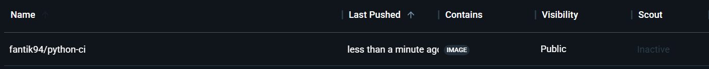

## CI/CD Pipeline

Notre projet utilise GitHub Actions pour l'intégration et le déploiement continus. Voici les différentes étapes configurées :

### Les Workflows GitHub Actions

#### Test (`test.yml`)
- Déclenché sur les push et pull requests vers la branche `dev`
- Exécute les tests unitaires Python
- Vérifie que tous les tests passent avant d'autoriser le déploiement

#### Build (`build.yml`)
- Déclenché sur les push et pull requests vers la branche `dev`
- Construit l'application et vérifie qu'elle peut être compilée sans erreur
- Prépare l'environnement pour le déploiement

#### Run (`run.yml`)
- Déclenché sur les push et pull requests vers la branche `dev`
- Lance l'application en environnement de test
- Vérifie que l'application démarre correctement

#### Push (`push.yml`)
- Déclenché sur les push et pull requests vers la branche `dev`
- Configure l'environnement Docker
- Se connecte à Docker Hub avec les credentials sécurisés
- Build l'image Docker pour linux/amd64
- Pousse l'image sur Docker Hub avec le tag `fantik94/python-ci:latest`

### Résultat

L'image Docker est bien publiée sur Docker Hub comme le montre la capture d'écran ci-dessous :

