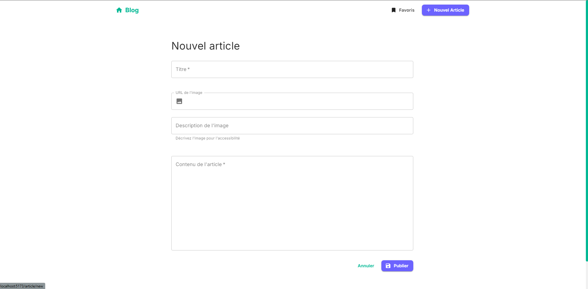
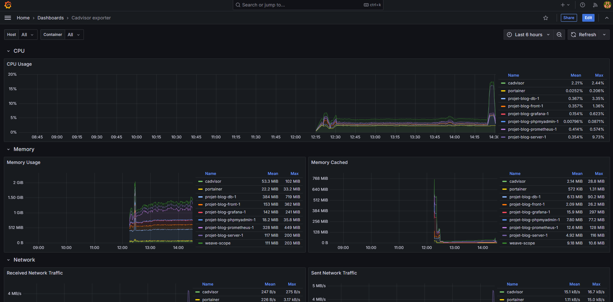

# Blog Project

## 📝 Description
Application de blog complète avec interface utilisateur React et backend Node.js, incluant monitoring et tests.

## 🚀 Installation et Démarrage

### Prérequis
- Docker et Docker Compose
- Node.js 18+
- npm

### Installation

#### Cloner le projet

```bash
cd projet-blog
```

#### Lancer les containers

```bash
docker-compose up -d
```

## 🔧 Services

### Reverse Proxy (Nginx)
- Port: 80 (HTTP, redirection vers HTTPS)
- Port: 443 (HTTPS)
- Gestion SSL avec certificats auto-signés
- Reverse proxy pour tous les services

### Frontend (React)
- Port interne: 5173
- URL: https://localhost

### Backend (Node.js/Express)
- Port interne: 3000
- API Documentation: https://localhost/api-docs

### Base de données (MySQL)
- Port: 3306
- PHPMyAdmin: http://localhost:8080

### Monitoring
- Prometheus: http://localhost:9090
- Grafana: http://localhost:3001
- cAdvisor: http://localhost:8081
- Portainer: http://localhost:9000
- Weave Scope: http://localhost:4040

## 📸 Screenshots

### Interface principale


### Création d'article


### Dashboard Monitoring


## ✅ Fonctionnalités Implémentées

### Frontend
- [x] Interface utilisateur React avec Material-UI
- [x] CRUD complet des articles
- [x] Tests Cypress end-to-end

### Backend
- [x] API RESTful avec Express
- [x] Documentation Swagger
- [x] Tests de charge avec Artillery

### Base de données
- [x] Schéma MySQL optimisé
- [x] Migration et seeding
- [x] Documentation complète ([voir DATABASE.md](./docs/DATABASE.MD))

### DevOps
- [x] Conteneurisation complète avec Docker
- [x] Pipeline CI/CD GitLab
- [x] Monitoring complet (Prometheus/Grafana)
- [x] Tests automatisés
- [x] Reverse proxy Nginx avec SSL/HTTPS
- [x] Certificats SSL auto-signés pour le développement

### Architecture
- [x] Documentation détaillée ([voir ARCHITECTURE.md](./docs/ARCHITECTURE.md))
- [x] Schéma d'architecture
- [x] Tests locaux
- [x] Sécurisation des communications avec HTTPS

## 🧪 Tests

### Tests Frontend

```bash
cd front
npm install
npm run test
npm run cypress:run
```


### Tests de Charge (Artillery)
```bash
cd server
npm run test:load
```
Exemple
> https://app.artillery.io/share/sh_03414ebfdce6d4067d71b8ba3c11b2b6c351b3ddf873c2f9b3cceea2ebd93629


## 📚 Documentation
- [Documentation API (Swagger)](http://localhost:3000/api-docs)
- [Architecture détaillée](./docs/ARCHITECTURE.md)
- [Structure de la base de données](./docs/DATABASE.md)

## 🛠️ Technologies Utilisées
- Frontend: React, Material-UI, Cypress
- Backend: Node.js, Express, Swagger
- Base de données: MySQL
- DevOps: Docker, GitLab CI, Prometheus, Grafana, Portainer, Weavescope
- Proxy: Nginx avec SSL/HTTPS
- Tests: Cypress (E2E), Artillery (Load Testing), Unit Tests