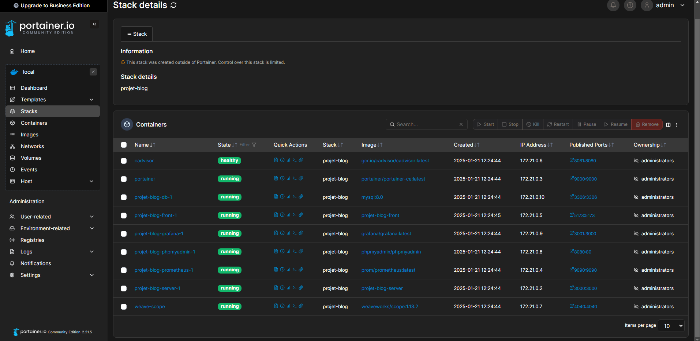
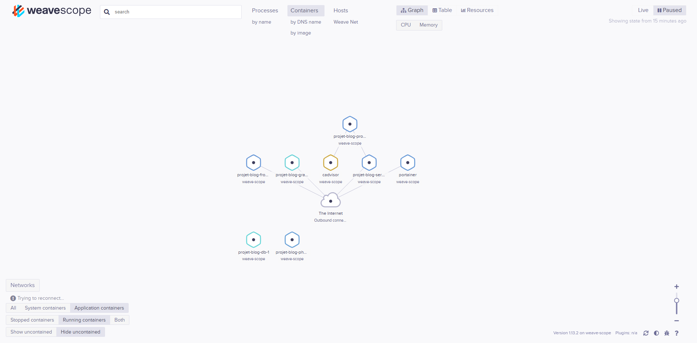

# Architecture du Projet

## Description des Composants

### Nginx Reverse Proxy (Ports 80, 443)
- **Technologie** : Nginx
- **Container** : nginx:alpine
- **Rôle** : 
  - Point d'entrée unique de l'application
  - Gestion SSL/HTTPS avec certificats auto-signés
  - Redirection HTTP vers HTTPS
  - Load balancing
  - Reverse proxy pour tous les services
- **Configuration** :
  - Redirection automatique HTTP → HTTPS
  - Terminaison SSL
  - Proxy vers frontend et backend
  - Headers de sécurité (HSTS, X-Frame-Options, etc.)

### Frontend (Port interne 5173)
- **Technologie** : React
- **Container** : node:18-alpine (dev)
- **Rôle** : Interface utilisateur du blog
- **Routes principales** :
  - `/` : Liste des articles (READ)
  - `/article/:id` : Détail d'un article (READ)
  - `/article/new` : Création d'un article (CREATE)
  - `/article/:id/edit` : Modification d'un article (UPDATE)
  - **Fonctionnalités CRUD** :
  - **Create** : Formulaire de création d'article
  - **Read** : Affichage liste et détail des articles
  - **Update** : Formulaire d'édition d'article
  - **Delete** : Bouton de suppression d'article
- **Accès** : https://localhost

### Backend (Port interne 3000)
- **Technologie** : Node.js/Express
- **Container** : Node
- **API Endpoints** :
  - `GET /api/articles` : Liste des articles
  - `GET /api/articles/:id` : Détail d'un article
  - `POST /api/articles` : Création d'article
  - `PUT /api/articles/:id` : Modification d'article
  - `DELETE /api/articles/:id` : Suppression d'article
- **Documentation API** :
  - Swagger UI : `https://localhost/api-docs`

### Base de Données (Port 3306)
- **Technologie** : MySQL
- **Container** : MySQL
- **Rôle** : Stockage persistant des données

### Monitoring & Administration

#### Prometheus (Port 9090)
- **Rôle** : Collecte de métriques
- **Métriques collectées** :
  - Performance des containers
  - Métriques HTTP
  - Métriques système

#### Grafana (Port 3001)
- **Rôle** : Visualisation des métriques
- **Dashboards** :
  - Performance des containers
  - Métriques API
  - Ressources système

#### Portainer (Port 9000)
- **Rôle** : Gestion des containers Docker
- **Fonctionnalités** :
  - Interface de gestion Docker
  - Monitoring des containers
  - Gestion des volumes et réseaux

## Communication entre les Services

### Frontend → Backend
- Protocol : HTTP/HTTPS
- Format : JSON
- **Requêtes CRUD** :
  - **Create** : `POST /api/articles` avec body JSON
  - **Read** : `GET /api/articles` et `GET /api/articles/:id`
  - **Update** : `PUT /api/articles/:id` avec body JSON
  - **Delete** : `DELETE /api/articles/:id`

### Client → Nginx
- Protocol : HTTPS (TLS 1.2/1.3)
- Ports : 443 (HTTPS), 80 (redirection vers HTTPS)
- Certificats : Auto-signés pour développement

### Nginx → Frontend
- Protocol : HTTP
- Port interne : 5173
- Proxy configuration :
  - Websocket support
  - Headers de sécurité
  - CORS

### Nginx → Backend
- Protocol : HTTP
- Port interne : 3000
- Path : /api/*
- Proxy configuration :
  - Headers de proxy
  - Timeouts optimisés

### Backend → Base de Données
- Protocol : MySQL Protocol
- Port : 3306
- Authentification : Credentials dans les variables d'environnement

### Services de Monitoring
- **Prometheus → Applications** : Collecte des métriques via endpoints `/metrics`
- **Grafana → Prometheus** : Requêtes PromQL pour visualisation
- **Portainer → Docker** : API Docker pour gestion des containers

## Réseaux Docker
- **frontend-network** : Communication Frontend-Nginx
- **backend-network** : Communication Backend-Database
- **monitoring-network** : Communication entre services de monitoring

## Ports Exposés
### Publics
- **80** : HTTP (redirection vers HTTPS)
- **443** : HTTPS (Nginx)

### Internes
- **5173** : Frontend (Vite dev server)
- **3000** : API Backend
- **3306** : MySQL
- **9090** : Prometheus
- **3001** : Grafana
- **9000** : Portainer
- **4040** : Weave Scope

## Sécurité
- Certificats SSL auto-signés pour HTTPS
- Reverse proxy masquant l'infrastructure interne
- Headers de sécurité HTTP
- Réseaux Docker isolés
- Variables d'environnement pour les secrets
- HSTS (HTTP Strict Transport Security)
- Protection contre les attaques XSS et CSRF

## Visualisation en Temps Réel avec Weave Scope

Weave Scope fournit une visualisation dynamique et interactive de notre architecture en temps réel. Accessible sur le port 4040, il permet de :
- Visualiser tous les containers et leurs relations
- Monitorer l'état des services
- Inspecter les métriques en direct
- Explorer les connexions réseau

> Note: Cette visualisation est accessible à l'adresse `http://localhost:4040`